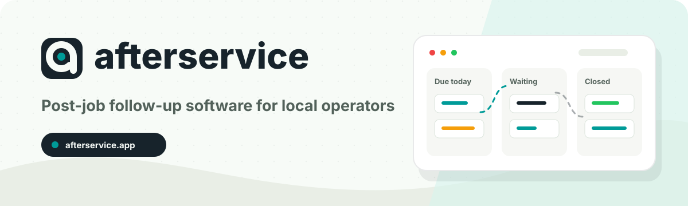

# afterservice



afterservice is after-service follow-up software for local operators. It helps service businesses turn completed work into structured customer check-ins, review requests, repeat visits, issue resolution, and referrals.

The product is built for repair shops, installers, clinics, salons, spas, local contractors, and field service teams whose customer experience continues after the job is done.

## Product Workflow

1. Record a customer.
2. Record a completed service job.
3. Create or schedule a follow-up.
4. Work the follow-up board.
5. Log contact, replies, outcomes, and closed loops.

## Monorepo

This repository is a private Bun/Turbo workspace.

| Path | Purpose |
| --- | --- |
| `apps/website` | Public marketing site for `afterservice.app`. |
| `apps/dashboard` | Authenticated operator dashboard for onboarding, customers, jobs, follow-ups, templates, billing, and settings. |
| `apps/api` | Hono/tRPC API for business operations, auth context, permissions, webhooks, and job endpoints. |
| `packages/auth` | Session, auth, and workspace membership helpers. |
| `packages/db` | Prisma/Postgres schema, generated client, query helpers, and domain types. |
| `packages/events` | Analytics/event contracts and helpers. |
| `packages/jobs` | Trigger.dev scheduled and background job logic. |
| `packages/notifications` | Message contracts and notification provider abstractions. |
| `packages/plans` | Shared plan and entitlement definitions. |
| `packages/site-nav` | Website and dashboard navigation registries. |
| `packages/ui` | Shared React UI components. |
| `packages/utils` | Pure shared utilities, including runtime URL helpers. |
| `packages/whatsapp` | WhatsApp integration client scaffolding. |
| `brain` | Durable project memory: product direction, architecture, decisions, tasks, API, and database docs. |

## Local Development

Requirements:

- Bun `1.3.9`
- Docker for the managed local Postgres profile
- The shared `local-infra-kit` sibling at `../../local-infra-kit`
- Base environment values in `.env` and mode-specific values in `.env.local`,
  `.env.dev`, `.env.preview`, or `.env.production`

Install dependencies:

```bash
bun install
```

Start the full local Portless stack:

```bash
bun run dev
```

The default command loads `.env.local`, verifies port `55433`, starts the
repository Docker Postgres service when needed, and then starts the selected
apps. Hosted profiles are explicit:

```bash
bun run dev --dev
bun run dev --preview
bun run dev --prod
```

Run one surface at a time:

```bash
bun run dev -f website
bun run dev -f dashboard
bun run dev -f api
bun run dev -f jobs
bun run dev -f website dashboard jobs
```

Fixed-port localhost URLs:

| App | URL |
| --- | --- |
| Website | `http://localhost:4100` |
| Dashboard | `http://localhost:4101` |
| API health | `http://localhost:4102/health` |

## Portless Dev URLs

Install [Portless](https://portless.dev) once, then run:

```bash
# All apps
bun run dev

# One app at a time
bun run dev -f website
bun run dev -f dashboard
bun run dev -f api

# Website + dashboard + jobs
bun run dev -f website dashboard jobs
```

Expected Portless URLs, using the default proxy on port `1355`:

| App | URL |
| --- | --- |
| Website | `http://afterservice.localhost:1355` |
| Dashboard | `http://app-afterservice.localhost:1355` |
| API | `http://api-afterservice.localhost:1355` |

Prefer the Portless scripts when debugging auth, redirects, callback behavior, or cross-app URL handling.

## Environment

Environment configuration is loaded by the shared local-infrastructure kit
from the workspace root.

- Every command loads `.env` plus exactly one selected mode file.
- Local mode is the default and uses `.env.local` plus Docker Postgres.
- Development, preview, and production modes must be selected explicitly.
- `.env.example` documents the required keys and is safe to commit.
- Do not commit real secret values.

Useful environment and database commands:

```bash
bun run db:validate
bun run db:generate
bun run db:migrate
bun run db:push
```

For an enabled internal QA build, issue a short-lived tester credential only
for an exact domain in `EMAIL_QA_DOMAIN_ROUTES`:

```bash
bun run qa:credential:issue -- afterservice.qa.test tester-name 24
bun run qa:credential:revoke -- <grant-id>
```

Only the issued credential is shown once. Stored grants and client
authorizations contain keyed digests, not reusable plaintext secrets.

Production env sync helpers:

```bash
# Import Vercel production envs to .env.production
bun run env:prod:import

# Preview which .env.production keys would be exported back to Vercel
bun run env:prod:export

# Export .env.production keys to Vercel production
bun run env:prod:export:apply
```

The export helper skips Vercel/system-generated keys by default and does not print secret values.

## Validation

Use the root scripts for broad checks:

```bash
bun run typecheck
bun run lint
bun run build
```

Focused smoke coverage:

```bash
bun run smoke:mvp
```

`bun run smoke:mvp` expects the dashboard dev server at `http://localhost:4101` unless `SMOKE_DASHBOARD_URL` is set. It verifies the local MVP journey: sign-up, onboarding, authenticated dashboard access, workspace-scoped CRUD, follow-up status transitions, manual send logging, permission rejection, entitlement limits, cron job authorization, and billing webhook signature/idempotency behavior.

Website PWA checks:

```bash
bun --cwd apps/website run pwa:verify
```

## Terminal Helper

Use the terminal helper to discover and run common project commands:

```bash
bun run terminal
bun run terminal check
bun run terminal dashboard
bun run terminal db:validate
bun run terminal prod:dashboard
bun run terminal prod:website
bun run terminal smoke:mvp
```

Use `prod:dashboard` or `prod:website` when reproducing production-only page-load failures. They build the selected app and start it locally with root `.env.production`.

## Deployment Notes

Production surfaces:

- Website: `https://afterservice.app`
- Dashboard: `https://dashboard.afterservice.app`
- Public API: `https://dashboard.afterservice.app/api`

Operational endpoints and jobs:

- Follow-up dry-run job: `POST https://dashboard.afterservice.app/api/jobs/follow-ups/dry-run` with `CRON_SECRET`
- Billing webhook processing lives under the dashboard API surface.
- Observability should alert on API 5xxs, webhook failures, cron failures, and database connection saturation.

### Trigger.dev Jobs

`packages/jobs` reads `TRIGGER_PROJECT_ID` from the workspace env and deploys with the Trigger.dev CLI profile in `TRIGGER_PROFILE` when it is set.

If Trigger.dev reports `Project not found` while using the `default` profile:

1. Run `bun --cwd packages/jobs trigger list-profiles`.
2. Log in to the intended account with `trigger login --profile <profile>`.
3. Set `TRIGGER_PROFILE=<profile>`.
4. Replace `TRIGGER_PROJECT_ID` with the project ref from that account.

## Engineering Notes

- Use the product name `afterservice`, the domain `afterservice.app`, and package namespace `@afterservice/*`.
- Use `buildSiteUrl`, `buildDashboardUrl`, and `buildApiUrl` from `@afterservice/utils` for cross-app URL construction.
- Keep app-specific UI inside the owning app until it is generic enough for `packages/ui`.
- Preserve server-side workspace permission checks for all workspace-scoped operations.
- Read and update `brain/` docs for meaningful product, architecture, API, database, billing, auth, or workflow changes.
